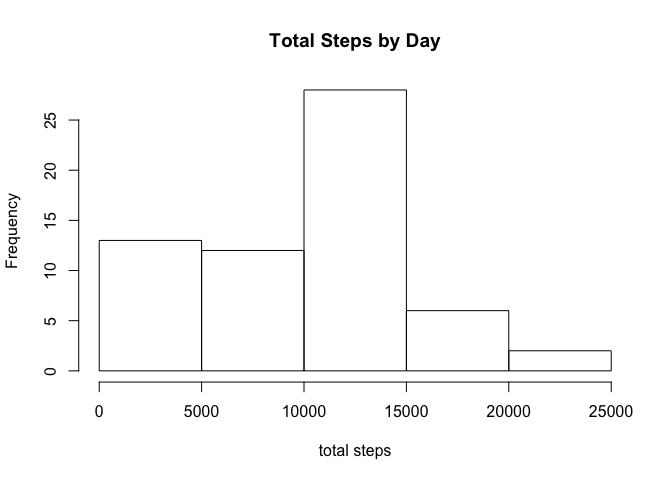
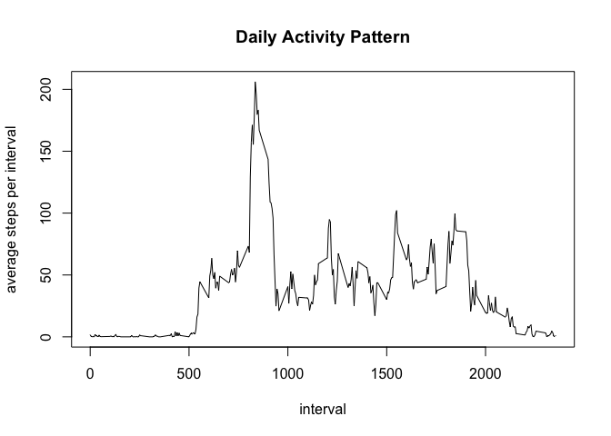
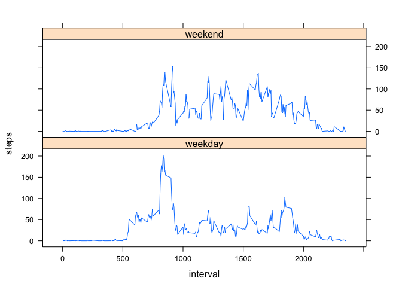

# Reproducible Research: Peer Assessment 1


## Loading and preprocessing the data

First, I need to transform the data into a dataframe. 

```r
startdata <-read.csv("activity.csv")
```


## What is mean total number of steps taken per day?

* Total steps by day
* Hisogram
* Mean
* median

```r
steps <- aggregate(startdata$steps, list(startdata$date),
                   sum,na.rm = TRUE)
hist(x=steps$x, breaks=6, main="Total Steps by Day",
     xlab="total steps")
```

 

```r
mean.steps<-mean(x=steps$x, na.rm = TRUE)
median.steps<-median(x=steps$x, na.rm = TRUE)
```

Mean:  9354.2295082

Median: 10395

## What is the average daily activity pattern?

The assignment says to get activity averages for the
intervals across the days.
I will show this with a time series plot.

```r
DailyTS <- aggregate(startdata$steps, list(startdata$interval),
                   mean,na.rm = TRUE)
plot(x=DailyTS$Group.1, y=DailyTS$x, type = "l",
     main="Daily Activity Pattern", xlab="interval",
     ylab="average steps per interval")
```

 

```r
max.interval <- DailyTS$Group.1[which.max(DailyTS$x)]
```

Interval with max number of steps:  835


## Imputing missing values

Replacing missing values with interval median.


```r
steps.median <- median(startdata$steps, na.rm = TRUE)

totalmissingvalues <- sum(is.na(startdata$steps))

fakedata <- startdata
fakedata$steps <- replace(x=fakedata$steps, is.na(fakedata$steps),
                          steps.median)

# Redo histogram, mean, median with fakedata

steps.f <- aggregate(fakedata$steps, list(fakedata$date), sum)
hist(x=steps.f$x, breaks=6, main="Total Steps by Day",
     xlab="total steps")
```

 

```r
mean.steps.f<-mean(x=steps.f$x)
median.steps.f<-median(x=steps.f$x)
```

Intervals with missing values:  2304

Mean:  9354.2295082

Median: 1.0395\times 10^{4}

These value are lower as the result of replacing missing values
with the overall median value.

## Are there differences in activity patterns between weekdays and weekends?

Comparison of weekday and weekend activity


```r
# Function identifies which days are weekend days
is.weekend <- function(x) { 
     datevalue <- as.POSIXct(x)
     weekday <- weekdays(datevalue, abbreviate=TRUE)
     # Weekend day names begin with S
     return(substr(weekday, 1, 1) == "S")
}

fakedata$weekend <- 
     as.factor(ifelse(is.weekend(as.character(fakedata$date)),
                                 "weekend", "weekday"))

steps.weekend <- 
     aggregate(fakedata$steps, 
               list(fakedata$interval, fakedata$weekend), mean)
colnames(steps.weekend) <- c("interval", "weekend", "steps")

library(lattice)
xyplot(steps ~ interval | weekend, steps.weekend, type="l",
       layout=c(1, 2))
```

 
